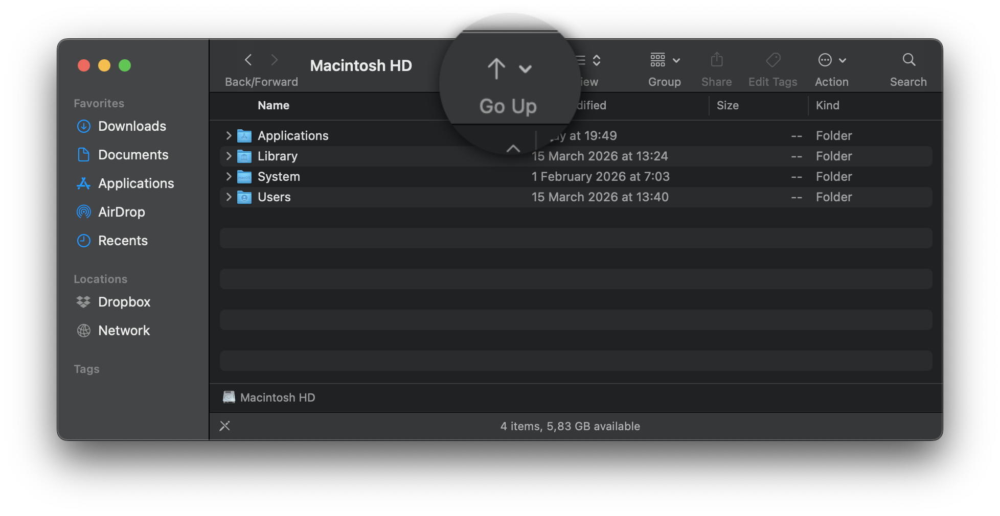

# OneUp for Finder

A tiny macOS app that adds a **Go Up** button to the Finder toolbar — one click to navigate to the parent folder, just like ⌘↑.



## Features

- Native **Finder toolbar button** that fits the macOS visual style
- Works in **every folder** — no configuration needed
- Replicates ⌘↑ exactly: navigates the current window, no new tabs
- Works in **Open / Save dialogs** (same extension, separate instance)
- Zero background processes — the extension is loaded on demand by macOS
- Signed, sandboxed, open source

## Requirements

- macOS 13 Ventura or later

## Installation

### Option A — Download (recommended)

1. Download `OneUp-latest.dmg` from [Releases](../../releases)
2. Open the DMG and drag **OneUp.app** to your `/Applications` folder
3. Launch **OneUp** and click **Open Extensions Settings**
4. Enable **OneUp** under *General → Login Items & Extensions → Finder Extensions*
5. In Finder, choose **View → Customize Toolbar…** and drag the **Go Up** button wherever you like

### Option B — Build from source

```bash
git clone https://github.com/marekcais/OneUp.git
cd OneUp
brew install xcodegen        # skip if already installed
xcodegen generate
open OneUp.xcodeproj
```

Then build and run the `OneUp` scheme in Xcode (⌘R). Sign in with your Apple ID if prompted.

## Uninstall

1. Delete `/Applications/OneUp.app`
2. The extension is removed automatically along with the app

## How it works

OneUp uses the **Finder Sync Extension** API — the only Apple-supported way to add buttons to the Finder toolbar. When you click the button:

1. The extension calls an AppleScript snippet that tells Finder's front window to navigate to `parent of target`
2. If AppleScript is unavailable (e.g., in certain dialog contexts) it falls back to opening the parent folder via `NSWorkspace`

The main app (`OneUp.app`) is only needed during initial setup. Once the extension is enabled it runs independently and the main app can be quit.

## macOS Sequoia note

macOS 15.0–15.1 temporarily removed the Finder Extensions UI from System Settings (fixed in 15.2). If you are on 15.0 or 15.1, enable the extension via Terminal:

```bash
pluginkit -e use -i io.github.oneup-app.OneUp.Extension
```

## Contributing

Pull requests are welcome. To regenerate the Xcode project after editing `project.yml`:

```bash
xcodegen generate
```

### Regenerate app icon

```bash
python3 scripts/generate_icon.py
```

## License

MIT — see [LICENSE](LICENSE)
